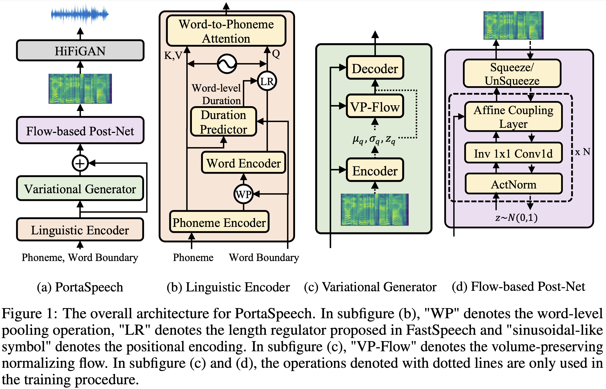
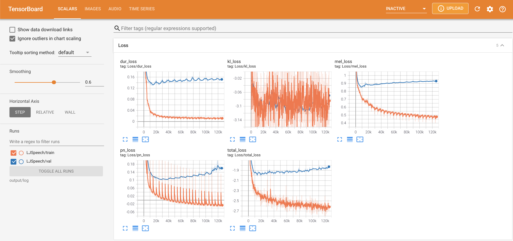
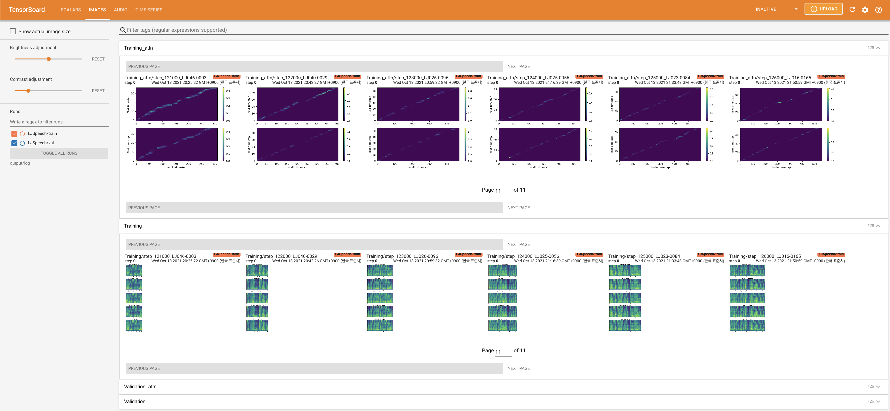
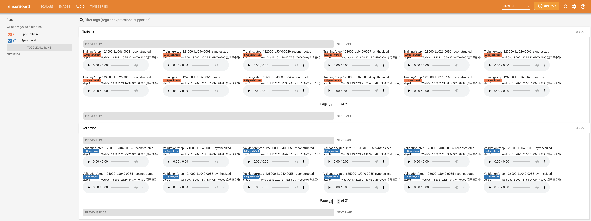
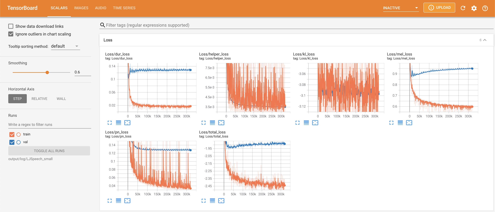
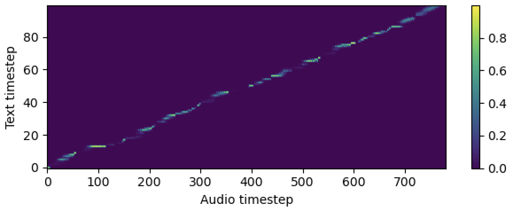
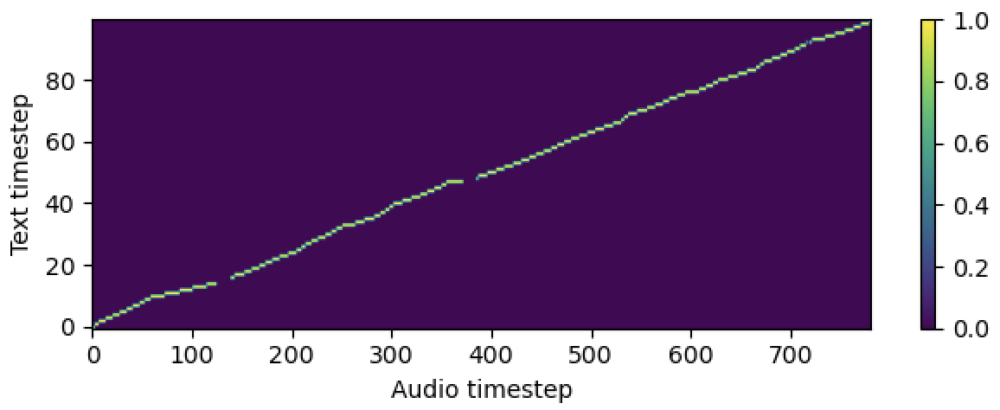
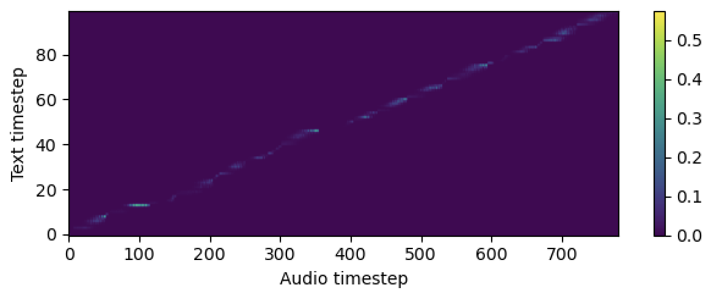

# PortaSpeech - PyTorch Implementation

PyTorch Implementation of [PortaSpeech: Portable and High-Quality Generative Text-to-Speech](https://arxiv.org/abs/2109.15166). 

<p align="center">
    
</p>

## Audio Samples
Audio samples are available at [/demo](https://github.com/keonlee9420/PortaSpeech/tree/main/demo).

## Model Size
| Module | Normal | Small | Normal (paper) | Small (paper) |
| :----- | :-----: | :-----: | :-----: | :-----: |
| *Total* | 24M | 7.6M | 21.8M | 6.7M
| *LinguisticEncoder* | 3.7M | 1.4M | - | -
| *VariationalGenerator* | 11M | 2.8M | - | -
| *FlowPostNet* | 9.3M | 3.4M | - | -


# Quickstart

***DATASET*** refers to the names of datasets such as `LJSpeech` in the following documents.
<!-- and `VCTK` in the following documents. -->

## Dependencies
You can install the Python dependencies with
```
pip3 install -r requirements.txt
```
Also, `Dockerfile` is provided for `Docker` users.

## Inference

You have to download the [pretrained models](https://drive.google.com/drive/folders/1lJwW4KbGJ5DnK788ZhCTDNeY9nqZyZMw?usp=sharing) and put them in `output/ckpt/DATASET/`.

For a **single-speaker TTS**, run
```
python3 synthesize.py --text "YOUR_DESIRED_TEXT" --restore_step RESTORE_STEP --mode single --dataset DATASET
```
<!-- 
For a **multi-speaker TTS**, run
```
python3 synthesize.py --text "YOUR_DESIRED_TEXT" --speaker_id SPEAKER_ID --restore_step RESTORE_STEP --mode single --dataset DATASET
``` -->

<!-- The dictionary of learned speakers can be found at `preprocessed_data/DATASET/speakers.json`, and  -->
The generated utterances will be put in `output/result/`.


## Batch Inference
Batch inference is also supported, try

```
python3 synthesize.py --source preprocessed_data/DATASET/val.txt --restore_step RESTORE_STEP --mode batch --dataset DATASET
```
to synthesize all utterances in `preprocessed_data/DATASET/val.txt`.

## Controllability
The speaking rate of the synthesized utterances can be controlled by specifying the desired duration ratios.
For example, one can increase the speaking rate by 20 by

```
python3 synthesize.py --text "YOUR_DESIRED_TEXT" --restore_step RESTORE_STEP --mode single --dataset DATASET --duration_control 0.8
```
<!-- Add ***--speaker_id SPEAKER_ID*** for a multi-speaker TTS. -->

Please note that the controllability is originated from [FastSpeech2](https://arxiv.org/abs/2006.04558) and not a vital interest of PortaSpeech.

# Training

## Datasets

The supported datasets are

- [LJSpeech](https://keithito.com/LJ-Speech-Dataset/): a **single-speaker** English dataset consists of 13100 short audio clips of a female speaker reading passages from 7 non-fiction books, approximately 24 hours in total.
<!-- - [VCTK](https://datashare.ed.ac.uk/handle/10283/3443): The CSTR VCTK Corpus includes speech data uttered by 110 English speakers (**multi-speaker TTS**) with various accents. Each speaker reads out about 400 sentences, which were selected from a newspaper, the rainbow passage and an elicitation paragraph used for the speech accent archive.

Any of both **single-speaker TTS** dataset (e.g., [Blizzard Challenge 2013](https://www.synsig.org/index.php/Blizzard_Challenge_2013)) and **multi-speaker TTS** dataset (e.g., [LibriTTS](https://openslr.org/60/)) can be added following LJSpeech and VCTK, respectively. Moreover, **your own language and dataset** can be adapted following [here](https://github.com/keonlee9420/Expressive-FastSpeech2). -->

## Preprocessing

<!-- - For a **multi-speaker TTS** with external speaker embedder, download [ResCNN Softmax+Triplet pretrained model](https://drive.google.com/file/d/1F9NvdrarWZNktdX9KlRYWWHDwRkip_aP) of [philipperemy's DeepSpeaker](https://github.com/philipperemy/deep-speaker) for the speaker embedding and locate it in `./deepspeaker/pretrained_models/`. -->
Run 
```
python3 prepare_align.py --dataset DATASET
```
for some preparations.

For the forced alignment, [Montreal Forced Aligner](https://montreal-forced-aligner.readthedocs.io/en/latest/) (MFA) is used to obtain the alignments between the utterances and the phoneme sequences.
Pre-extracted alignments for the datasets are provided [here](https://drive.google.com/drive/folders/1fizpyOiQ1lG2UDaMlXnT3Ll4_j6Xwg7K?usp=sharing). 
You have to unzip the files in `preprocessed_data/DATASET/TextGrid/`. Alternately, you can [run the aligner by yourself](https://montreal-forced-aligner.readthedocs.io/en/latest/user_guide/workflows/index.html).

After that, run the preprocessing script by
```
python3 preprocess.py --dataset DATASET
```

## Training

Train your model with
```
python3 train.py --dataset DATASET
```
Useful options:
- To use [Automatic Mixed Precision](https://pytorch.org/tutorials/recipes/recipes/amp_recipe.html), append `--use_amp` argument to the above command.
- The trainer assumes single-node multi-GPU training. To use specific GPUs, specify `CUDA_VISIBLE_DEVICES=<GPU_IDs>` at the beginning of the above command.

# TensorBoard

Use
```
tensorboard --logdir output/log
```

to serve TensorBoard on your localhost.
The loss curves, synthesized mel-spectrograms, and audios are shown.

## Normal Model




## Small Model Loss


# Notes

- For vocoder, **HiFi-GAN** and **MelGAN** are supported.
- No ReLU activation and LayerNorm in **VariationalGenerator** to avoid mashed output.
- Speed ​​up the convergence of word-to-phoneme alignment in **LinguisticEncoder** by dividing long words into subwords and sorting the dataset by mel-spectrogram frame length.
- There are two kinds of helper loss to improve word-to-phoneme alignment: "ctc" and "dga". You can toggle them as follows:
    ```yaml
    # In the train.yaml
    aligner:
        helper_type: "dga" # ["dga", "ctc", "none"]
    ```
    - "dga": [Diagonal Guided Attention (DGA)](https://arxiv.org/abs/1710.08969) Loss
    - "ctc": [Connectionist Temporal Classification (CTC)](https://dl.acm.org/doi/pdf/10.1145/1143844.1143891) Loss with forward-sum algorithm
    - If you set "none", no helper loss will be applied during training.
    - The alignments comparision of three methods ("dga", "ctc", and "none" from top to bottom):
        
        
        
    - The default setting is "dga". Although "ctc" makes the strongest alignment, the output quality and the accuracy are worse than "dga".
    - But still, there is a room for the improvement of output quality. The audio quality and the alingment (accuracy) seem to be a trade-off.
- Will be extended to a **multi-speaker TTS**.
<!-- - Two options for embedding for the **multi-speaker TTS** setting: training speaker embedder from scratch or using a pre-trained [philipperemy's DeepSpeaker](https://github.com/philipperemy/deep-speaker) model (as [STYLER](https://github.com/keonlee9420/STYLER) did). You can toggle it by setting the config (between `'none'` and `'DeepSpeaker'`).
- DeepSpeaker on VCTK dataset shows clear identification among speakers. The following figure shows the T-SNE plot of extracted speaker embedding.

<p align="center">
    
</p> -->

# Citation

Please cite this repository by the "[Cite this repository](https://github.blog/2021-08-19-enhanced-support-citations-github/)" of **About** section (top right of the main page).

# References
- [jaywalnut310's VITS](https://github.com/jaywalnut310/vits)
- [jaywalnut310's Glow-TTS](https://github.com/jaywalnut310/glow-tts)
- [keonlee9420's VAENAR-TTS](https://github.com/keonlee9420/VAENAR-TTS)
- [keonlee9420's Comprehensive-Transformer-TTS](https://github.com/keonlee9420/Comprehensive-Transformer-TTS) (CTC Loss)
- [keonlee9420's Comprehensive-Tacotron2](https://github.com/keonlee9420/Comprehensive-Tacotron2) (DGA Loss)
